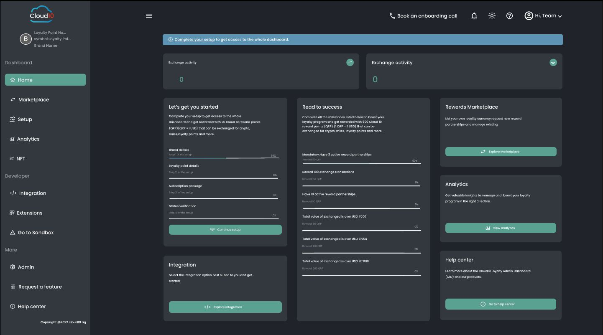
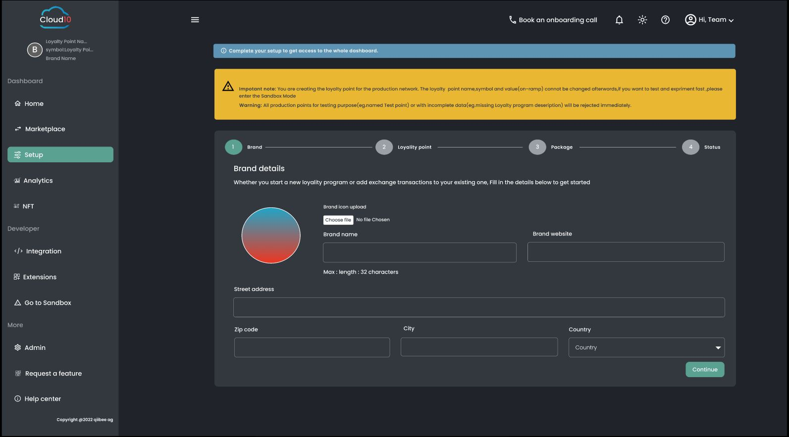
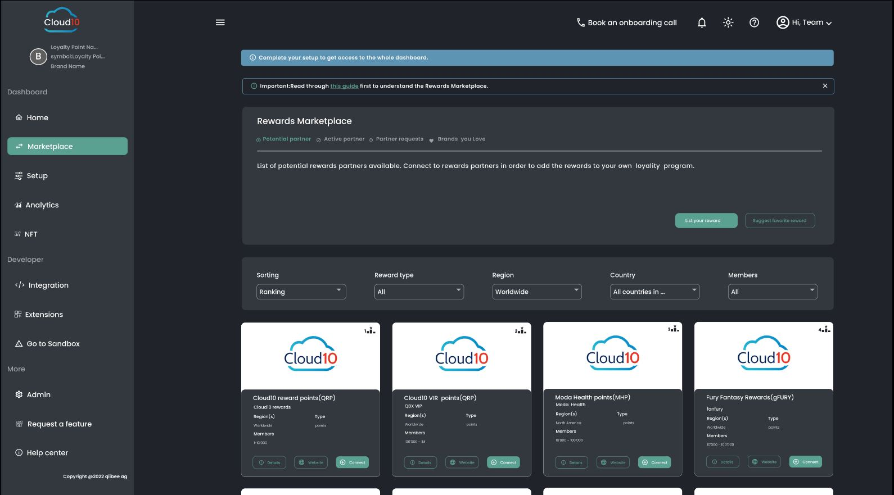
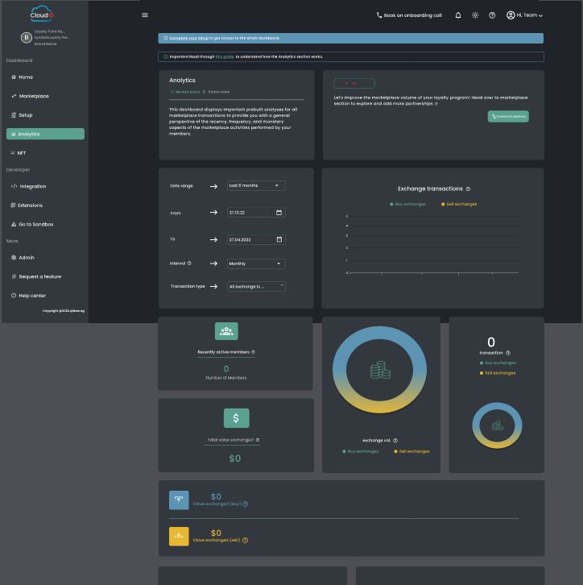

# Cloud10 Loyality Management Syestem

Cloud10 LMS (Loyalty Management System) is a platform that helps businesses to integrate, implement and manage their loyalty programs. It provides a centralized platform for tracking customer interactions, managing rewards and incentives, and analyzing customer behavior and preferences. The system is designed as a pluggable module for Channels or Booking Engines of the hospitality domain.

Features

This loyalty management system includes features such as:

Customer Backend:
A decentralized customer backend on the Cardano blockchain can provide a secure and transparent way to store customer information, including their purchase history, loyalty program status.
Transaction records can be stored on the blockchain to maintain an immutable history of each customer's purchases, enabling retailers to provide personalized offers and recommendations based on their purchase history.
The use of smart contracts on the Cardano blockchain can enable retailers to implement loyalty programs that can automatically reward customers based on their purchases and other predetermined criteria.
With Cardano's high level of security, customers can be assured that their personal data is protected and cannot be tampered with or hacked.
Overall, a decentralized customer backend on the Cardano blockchain can offer numerous benefits for retailers and customers, including increased transparency, security, and personalized experiences.
Rewards management: A module for managing rewards and incentives, such as points, discounts, free products, or exclusive offers.
Customer Engagement: Tools for engaging customers, such as targeted messaging, personalized recommendations, and social media integrations.
Analytics and reporting: A dashboard that provides insights into customer behavior, program performance, and ROI.
Administration and security: Tools for managing program rules, settings, and access levels, as well as ensuring compliance with data protection regulations

# Admin Panel User Interface







# Prerequisites

## Docker

* Make sure you have Docker installed in your system. To install docker in windows or mac download the docker applicaion from [https://www.docker.com/](https://www.docker.com).
* To install docker in linux refer to this [how to install docker in ubuntu/linux](https://www.digitalocean.com/community/tutorials/how-to-install-and-use-docker-on-ubuntu-20-04) website.
* In Ubuntu you will also need the install the docker-compose separately. To install docker-compose refer to this [docker-compose](https://www.digitalocean.com/community/tutorials/how-to-install-and-use-docker-compose-on-ubuntu-20-04) website.


## Run Locally

Clone the project

```bash
  # usual cloning method
  git clone https://github.com/Cloud10-Loyality/cloud10Loyality.git

  # if the above method doesn't work, then try cloning the repo using github cli.
  gh repo clone Cloud10-Loyality/cloud10Loyality
```

Go to the project directory

```bash
  cd cloud10Loyality
```

To run the server

```bash
    cd server

    # To build the server
    docker compose build

    # To run the server
    docker comopse up
```

